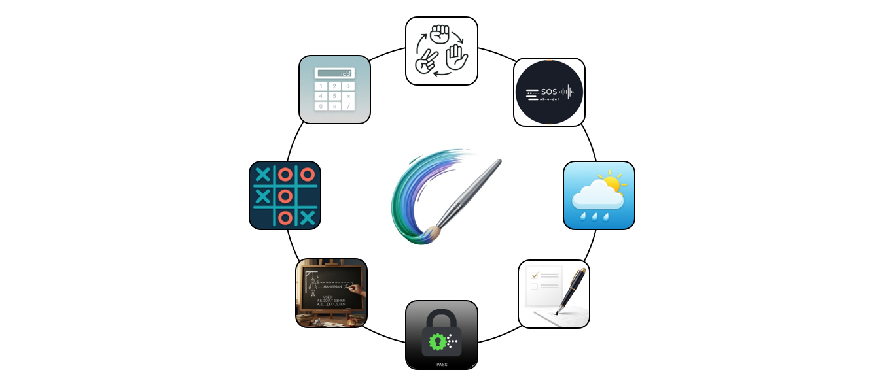

## 📁 Java GUI – 10 Mini Projects Challenge

👨‍💻 *by Sarmad Rj*

This repository is the result of my self-imposed challenge:
**“10 Java Projects in 5 Days”** – where I pushed myself to explore and build real-world mini-projects using Core Java & Swing. Each project helped reinforce a new concept or library.

---

## 📋 Project Tracker

| #  | Project Name                    | Type             | Key Concepts Learned |
|----|---------------------------------|------------------|----------------------|
| 1️⃣ | Paint App                      | Swing GUI        | Event handling, drawing, image saving (`ImageIO`) |
| 2️⃣ | Calculator                     | Swing GUI        | OOP, numeric parsing, `JButton` events, formatting |
| 3️⃣ | Rock Paper Scissors            | Swing GUI        | Randomization, control flow, game logic & layout |
| 4️⃣ | To-Do List Manager             | Swing GUI + JSON | Gson serialization, file I/O, checkboxes, UI layout |
| 5️⃣ | Tic Tac Toe                    | Swing GUI        | 2D arrays, event listeners, modular game logic |
| 6️⃣ | Password Generator & Manager   | CLI + MongoDB    | Secure key handling (`.env`), CRUD via MongoDB driver |
| 7️⃣ | Weather App                    | Swing GUI + API  | HTTP requests, JSON parsing, layered GUI, APIs |
| 8️⃣ | Morse Code Translator          | Swing GUI + Audio| `HashMap`, KeyListener, sound synthesis (beeps via audio API) |
| 9️⃣ | Chat App (GUI + CLI)           | Networked App    | `Socket` programming, multithreading, synchronized `HashSet`, Swing GUI chat UI |
| 🔟 | Hangman Game                   | Swing GUI + File | File reading, word masking with `HashMap`, custom fonts, game states |

---

## 🧠 Highlights & Learnings

- **Core Java mastery**: Collections, file handling, loops, conditions, OOP patterns, threading, `HashMap`, `Threads`, and `File Handling`
- **Networking & concurrency**: Built a real-time chat app handling multiple users with threads
- **API consumption & UI**: Integrated weather data via REST API and rendered data cleanly in Swing
- **Sound & Interactive apps**: Translated text to Morse and played it via live console audio
- **Secrets management**: Hidden API keys & Mongo URI using environment variables, `.env` files and `.gitignore`—protecting creds from public repo exposure
- Learned how different Java APIs and libraries fit together to make complete desktop tools.

---

## ⚙️ Tech Stack

* **Language:** Java (Core Java 8+)
* **GUI:** Swing
* **Networking:** Java Sockets
* **Data Handling:** Gson for JSON, Java I/O
* **API Integration:** OpenWeatherMap (for Weather App)

---

## 👥 Shoutouts & Collab
Big thanks to:

My friend [Ikram](https://github.com/Softcode777) for the cross-stack collab—building Tic Tac Toe in JS while I built it in Java (shared learning FTW!),
You can connect with him [here](https://www.linkedin.com/in/ikram-ullah-khan-niazi-02b373329/).

---
## ScreenShots (click to expand)

1. 🖌️ Paint App Screenshots 

  
  
  
  

2. 🧮 Calculator 

  
  
  
  

3. ✊✋✌️ Rock Paper Scissors  

  
  
  
  

4. 📝 To-Do List Manager  

  
  
  
  

5. ❌⭕ Tic Tac Toe  

  
  
  
  

6. 🔐 Password Generator & Manager  

  
  
  
  

  
7. 📡 Morse Code Translator  

  
  
  
  

8 🌦️ Weather App  

  
  
  
  

9. 💬 Chat App (GUI + CLI) 

  
  
  
  

10. 🎯 Hangman Game 

  
  
  
  

---
## Live Preview
All of em are available to watch on my linkedIn 

* [Day 1](https://www.linkedin.com/posts/sarmad-rj-1505and12_java-javaswing-programming-activity-7353789741697265665-IMkQ?utm_source=social_share_send&utm_medium=member_desktop_web&rcm=ACoAADo90pkBOcPM5XxpDcFQKxNzSGjORUWns4s)
* [Day 2](https://www.linkedin.com/posts/sarmad-rj-1505and12_java-oop-javaswing-activity-7354374868374630403-6RsA?utm_source=social_share_send&utm_medium=member_desktop_web&rcm=ACoAADo90pkBOcPM5XxpDcFQKxNzSGjORUWns4s)
* [Day 3](https://www.linkedin.com/posts/sarmad-rj-1505and12_java-javaswing-github-activity-7354744799800844290-PIiF?utm_source=social_share_send&utm_medium=member_desktop_web&rcm=ACoAADo90pkBOcPM5XxpDcFQKxNzSGjORUWns4s)
* [Day 4](https://www.linkedin.com/posts/sarmad-rj-1505and12_java-apis-swing-activity-7355150584552812544-QtO-?utm_source=social_share_send&utm_medium=member_desktop_web&rcm=ACoAADo90pkBOcPM5XxpDcFQKxNzSGjORUWns4s)
* [Day 5](https://www.linkedin.com/posts/sarmad-rj-1505and12_java-100daysofcode-javaswing-activity-7355582870653960194-cdcg?utm_source=social_share_send&utm_medium=member_desktop_web&rcm=ACoAADo90pkBOcPM5XxpDcFQKxNzSGjORUWns4s)

---

## ⭐ Star this Repo if You Found It Useful!

